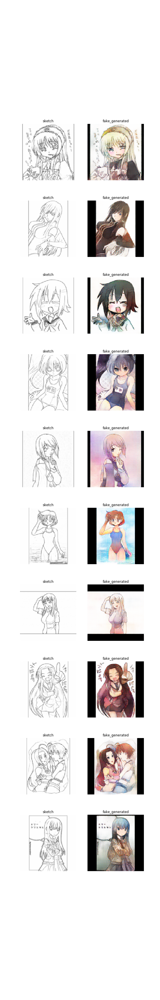

# Sketch2Color-conditional-GAN
Using concept of Conditional GAN we will generate fake color image conditioned over sketch images

Dataset from kaggle.

Link:- https://www.kaggle.com/wuhecong/danbooru-sketch-pair-128x

Get a detailed explanation over my blog.

Link :- https://medium.com/@raviranjankr165/sketch-to-color-anime-an-application-of-conditional-gan-e40f59c66281

The results over test data is below.

